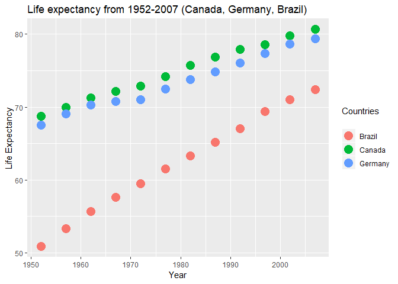

hw04-exercise
================

Tidy data and joins
===================

Initialize the data
-------------------

-   Load the gapminder, tidyverse and knitr libraries:

``` r
suppressPackageStartupMessages(library(tidyverse))
suppressPackageStartupMessages(library(gapminder))
suppressPackageStartupMessages(library(knitr))
```

-   We will take a quick look at the data to *sanity check* that the data and variables appear as we expect:

``` r
(head(gapminder))
```

    ## # A tibble: 6 x 6
    ##   country     continent  year lifeExp      pop gdpPercap
    ##   <fct>       <fct>     <int>   <dbl>    <int>     <dbl>
    ## 1 Afghanistan Asia       1952    28.8  8425333      779.
    ## 2 Afghanistan Asia       1957    30.3  9240934      821.
    ## 3 Afghanistan Asia       1962    32.0 10267083      853.
    ## 4 Afghanistan Asia       1967    34.0 11537966      836.
    ## 5 Afghanistan Asia       1972    36.1 13079460      740.
    ## 6 Afghanistan Asia       1977    38.4 14880372      786.

-   Everything looks as expected, so let's start exploring the data

Data Re-shaping Prompt
----------------------

*Activity 2: Make a tibble with one row per year and columns for life expectancy for two or more countries. Use kable() to make the table look pretty. Scatterplot life expectancy for one country against that of another.*

### Method

-   Reduce the data subset using select and group\_by
-   Spread the countries across the columns
-   Build a table and a scatterplot

``` r
q1_table <- gapminder %>% #Create a tibble so we can re-use it later
  select(year, country, lifeExp) %>% #Reduce the data set size for faster processing
    group_by(year) %>% 
      spread(key = "country", value = "lifeExp") %>% 
        select("Canada", "Germany", "Brazil")# %>%
```

    ## Adding missing grouping variables: `year`

``` r
q1_table %>% 
  kable(col.names = c("Year", "Canada", "Germany", "Brazil")) #Use kable to enhance the output
```

|  Year|  Canada|  Germany|  Brazil|
|-----:|-------:|--------:|-------:|
|  1952|  68.750|   67.500|  50.917|
|  1957|  69.960|   69.100|  53.285|
|  1962|  71.300|   70.300|  55.665|
|  1967|  72.130|   70.800|  57.632|
|  1972|  72.880|   71.000|  59.504|
|  1977|  74.210|   72.500|  61.489|
|  1982|  75.760|   73.800|  63.336|
|  1987|  76.860|   74.847|  65.205|
|  1992|  77.950|   76.070|  67.057|
|  1997|  78.610|   77.340|  69.388|
|  2002|  79.770|   78.670|  71.006|
|  2007|  80.653|   79.406|  72.390|

``` r
#Check that the data is a tibble
#Change my graph theme
```

Plot
====

``` r
q1_table %>%
  ggplot(aes(x = year, y = value, color = variable)) +
  geom_point(aes(y = Canada, col = "Canada"), size=5) +
  geom_line(aes(y = Canada, col = "Canada")) +
  geom_point(aes(y = Germany, col = "Germany"), size=5) +
  geom_line(aes(y = Germany, col = "Germany")) +
  geom_point(aes(y = Brazil, col = "Brazil"), size=5) +
  geom_line(aes(y = Brazil, col = "Brazil")) +
  #Add labels
  labs(title = "Life expectancy from 1952-2007, (Canada, Germany, Brazil)",
    x = "Year", y = "Life Expectancy",
    color = "Countries\n")
```



### Observations & Analyses

I didn't end up using gather() (which effectively does the opposite as spread.

Join Prompt (join, merge, look up)
----------------------------------

*Activity 2: Make your own cheatsheet; iterate between your data prep and your joining to make your explorations comprehensive and interesting. Demonstrate all the types of joins.*

### Method

-   Reduce the data subset using select and group\_by
-   Find the minimum and maximum values

``` r
medieval_weapons <- "
name,        attack_type, wielding,       damage
shuriken,    ranged,      one-handed,     2
flail,       melee,       one-handed,     4
great_sword, melee,       two-handed,     8
crossbow,    ranged,      one-handed,     2
Excalibur,   melee,       one-handed,     6
dagger,      melee,       one-handed,     3
staff,       melee,       two-handed,     5
"
medieval_weapons <- read_csv(medieval_weapons, skip = 1)

stun_bonus <- "
  wielding,   chance_to_stun
  two-handed, 0.15
"
stun_bonus <- read_csv(stun_bonus, skip = 1)

left_join(medieval_weapons, stun_bonus) %>% 
  kable(caption = "Left Join")
```

    ## Joining, by = "wielding"

| name         | attack\_type | wielding   |  damage|  chance\_to\_stun|
|:-------------|:-------------|:-----------|-------:|-----------------:|
| shuriken     | ranged       | one-handed |       2|                NA|
| flail        | melee        | one-handed |       4|                NA|
| great\_sword | melee        | two-handed |       8|              0.15|
| crossbow     | ranged       | one-handed |       2|                NA|
| Excalibur    | melee        | one-handed |       6|                NA|
| dagger       | melee        | one-handed |       3|                NA|
| staff        | melee        | two-handed |       5|              0.15|

``` r
right_join(medieval_weapons, stun_bonus) %>% 
  kable()
```

    ## Joining, by = "wielding"

| name         | attack\_type | wielding   |  damage|  chance\_to\_stun|
|:-------------|:-------------|:-----------|-------:|-----------------:|
| great\_sword | melee        | two-handed |       8|              0.15|
| staff        | melee        | two-handed |       5|              0.15|

``` r
inner_join(medieval_weapons, stun_bonus)
```

    ## Joining, by = "wielding"

    ## # A tibble: 2 x 5
    ##   name        attack_type wielding   damage chance_to_stun
    ##   <chr>       <chr>       <chr>       <int>          <dbl>
    ## 1 great_sword melee       two-handed      8           0.15
    ## 2 staff       melee       two-handed      5           0.15

``` r
full_join(medieval_weapons, stun_bonus)
```

    ## Joining, by = "wielding"

    ## # A tibble: 7 x 5
    ##   name        attack_type wielding   damage chance_to_stun
    ##   <chr>       <chr>       <chr>       <int>          <dbl>
    ## 1 shuriken    ranged      one-handed      2          NA   
    ## 2 flail       melee       one-handed      4          NA   
    ## 3 great_sword melee       two-handed      8           0.15
    ## 4 crossbow    ranged      one-handed      2          NA   
    ## 5 Excalibur   melee       one-handed      6          NA   
    ## 6 dagger      melee       one-handed      3          NA   
    ## 7 staff       melee       two-handed      5           0.15

*Activity 3: Explore the merge() and match() functions. Contrast and compare.*

### Method

-   Reduce the data subset using se
