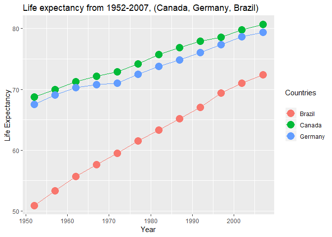

# Tidy data and joins

## Initialize the data

* Load the gapminder, tidyverse, knitr and kableExtra libraries:


```r
suppressPackageStartupMessages(library(tidyverse))
suppressPackageStartupMessages(library(gapminder))
suppressPackageStartupMessages(library(knitr))
suppressPackageStartupMessages(library(kableExtra))
```

* The *kableExtra* package gives new options for styling tables (but since they are in HTML, we won't get to see the effects in this .md file)
* We will take a quick look at the data to *sanity check* that the data and variables appear as we expect:


```r
(head(gapminder))
```

```
## # A tibble: 6 x 6
##   country     continent  year lifeExp      pop gdpPercap
##   <fct>       <fct>     <int>   <dbl>    <int>     <dbl>
## 1 Afghanistan Asia       1952    28.8  8425333      779.
## 2 Afghanistan Asia       1957    30.3  9240934      821.
## 3 Afghanistan Asia       1962    32.0 10267083      853.
## 4 Afghanistan Asia       1967    34.0 11537966      836.
## 5 Afghanistan Asia       1972    36.1 13079460      740.
## 6 Afghanistan Asia       1977    38.4 14880372      786.
```

* Everything looks as expected, so let's start exploring the data

## Data Re-shaping Prompt
### *Activity 2: Make a tibble with one row per year and columns for life expectancy for two or more countries. Use kable() to make the table look pretty. Scatterplot life expectancy for one country against that of another.*

### Method
* Reduce the data subset using *select()* and *group_by()*
* Spread the countries across the columns using *spread()*
* Build a table and a scatterplot to compare life expectancy for two or more countries

### Table


```r
q1_table <- gapminder %>% #Creates a tibble so we can re-use it later
  select(year, country, lifeExp) %>% #Reduces the data set size for faster processing
    group_by(year) %>% 
      spread(key = "country", value = "lifeExp") %>% 
        select("Canada", "Germany", "Brazil") 
```

```
## Adding missing grouping variables: `year`
```

```r
is.tibble(q1_table)
```

```
## [1] TRUE
```

```r
q1_table %>% 
  kable(col.names = c("Year", "Canada", "Germany", "Brazil")) %>% #Using kable enhances the output
    kable_styling()
```

<table class="table" style="margin-left: auto; margin-right: auto;">
 <thead>
  <tr>
   <th style="text-align:right;"> Year </th>
   <th style="text-align:right;"> Canada </th>
   <th style="text-align:right;"> Germany </th>
   <th style="text-align:right;"> Brazil </th>
  </tr>
 </thead>
<tbody>
  <tr>
   <td style="text-align:right;"> 1952 </td>
   <td style="text-align:right;"> 68.750 </td>
   <td style="text-align:right;"> 67.500 </td>
   <td style="text-align:right;"> 50.917 </td>
  </tr>
  <tr>
   <td style="text-align:right;"> 1957 </td>
   <td style="text-align:right;"> 69.960 </td>
   <td style="text-align:right;"> 69.100 </td>
   <td style="text-align:right;"> 53.285 </td>
  </tr>
  <tr>
   <td style="text-align:right;"> 1962 </td>
   <td style="text-align:right;"> 71.300 </td>
   <td style="text-align:right;"> 70.300 </td>
   <td style="text-align:right;"> 55.665 </td>
  </tr>
  <tr>
   <td style="text-align:right;"> 1967 </td>
   <td style="text-align:right;"> 72.130 </td>
   <td style="text-align:right;"> 70.800 </td>
   <td style="text-align:right;"> 57.632 </td>
  </tr>
  <tr>
   <td style="text-align:right;"> 1972 </td>
   <td style="text-align:right;"> 72.880 </td>
   <td style="text-align:right;"> 71.000 </td>
   <td style="text-align:right;"> 59.504 </td>
  </tr>
  <tr>
   <td style="text-align:right;"> 1977 </td>
   <td style="text-align:right;"> 74.210 </td>
   <td style="text-align:right;"> 72.500 </td>
   <td style="text-align:right;"> 61.489 </td>
  </tr>
  <tr>
   <td style="text-align:right;"> 1982 </td>
   <td style="text-align:right;"> 75.760 </td>
   <td style="text-align:right;"> 73.800 </td>
   <td style="text-align:right;"> 63.336 </td>
  </tr>
  <tr>
   <td style="text-align:right;"> 1987 </td>
   <td style="text-align:right;"> 76.860 </td>
   <td style="text-align:right;"> 74.847 </td>
   <td style="text-align:right;"> 65.205 </td>
  </tr>
  <tr>
   <td style="text-align:right;"> 1992 </td>
   <td style="text-align:right;"> 77.950 </td>
   <td style="text-align:right;"> 76.070 </td>
   <td style="text-align:right;"> 67.057 </td>
  </tr>
  <tr>
   <td style="text-align:right;"> 1997 </td>
   <td style="text-align:right;"> 78.610 </td>
   <td style="text-align:right;"> 77.340 </td>
   <td style="text-align:right;"> 69.388 </td>
  </tr>
  <tr>
   <td style="text-align:right;"> 2002 </td>
   <td style="text-align:right;"> 79.770 </td>
   <td style="text-align:right;"> 78.670 </td>
   <td style="text-align:right;"> 71.006 </td>
  </tr>
  <tr>
   <td style="text-align:right;"> 2007 </td>
   <td style="text-align:right;"> 80.653 </td>
   <td style="text-align:right;"> 79.406 </td>
   <td style="text-align:right;"> 72.390 </td>
  </tr>
</tbody>
</table>
### Plot


```r
q1_table %>%
  ggplot(aes(x = year, y = value, color = variable)) +
  geom_point(aes(y = Canada, col = "Canada"), size=5) +
  geom_line(aes(y = Canada, col = "Canada")) +
  geom_point(aes(y = Germany, col = "Germany"), size=5) +
  geom_line(aes(y = Germany, col = "Germany")) +
  geom_point(aes(y = Brazil, col = "Brazil"), size=5) +
  geom_line(aes(y = Brazil, col = "Brazil")) +
  #Add labels
  labs(title = "Life expectancy from 1952-2007, (Canada, Germany, Brazil)",
    x = "Year", y = "Life Expectancy",
    color = "Countries\n")
```

<!-- -->

### Observations & Analyses
The slope of the lines indicates the rate of increase of life expectancy. From the plot, we observe that the life expectancy for Brazil increased at the highest rate over the time period studied, although the absolute value of life expectancy is higher in both Canada and Germany, respectively, than in Brazil. The life expectancy of Canada and Germany increases at approximately the rate, where Canada's life expectancy is marginally higher. We observe a small dip in life expectancy in Germany in the mid-1970s. All of the countries exhibit a positive linear correlation between life expectancy and time.

The table is useful for picking out exact values and comparing values on a year-by-year basis. However, it is easier to see the overall trend of increasing life expectancy for all countries in the multi-series plot. I didn't need to use the gather() function to create either the table or the plot, as it effectively does the opposite as the spread function. I'm curious to find out whether there is a more concise way to code multiple y-series on a plot (e.g. using a loop to auto-read in the table names and data rather than hard-coding).

## Join Prompt (join, merge, look up)
### *Activity 2: Make your own cheatsheet; iterate between your data prep and your joining to make your explorations comprehensive and interesting. Demonstrate all the types of joins.*

### Method
* Create two tables with some overlapping columns and rows
* Explore different types of joins

### Dataset Creation
* We will create a dataset to experiment with joins:


```r
medieval_weapons <- "
name,        attack_type, wielding,       damage
shuriken,    ranged,      one-handed,     2       
flail,       melee,       one-handed,     4        
great_sword, melee,       two-handed,     8      
crossbow,    ranged,      one-handed,     2        
Excalibur,   melee,       one-handed,     6        
dagger,      melee,       one-handed,     3       
staff,       melee,       two-handed,     5       
"
medieval_weapons <- read_csv(medieval_weapons, skip = 1)

stun_bonus <- "
  wielding,   chance_to_stun,   stun_damage
  two-handed, 0.15,             10
"
stun_bonus <- read_csv(stun_bonus, skip = 1)
```

### Left and Right Joins
* *Left_join(x,y)* uses *x* as a starting point; it matches columns from *y* to *x*
* A left join example is shown in the **left** table, below
* *Right_join(x,y)* uses *y* as a starting point; it matches columns from *x* to *y*
* A right join example is shown in the **right** table, below


```r
lj <- left_join(medieval_weapons, stun_bonus, by = "wielding")
rj <- right_join(medieval_weapons, stun_bonus, by = "wielding")
kable(
  list(lj, rj),
  col.names = c("Weapon", "Attack Type", "Wielding Type", "Damage (HP)", "Chance to Stun", "Stun Damage (HP)"))
```

<table class="kable_wrapper">
<tbody>
  <tr>
   <td> 

<table>
 <thead>
  <tr>
   <th style="text-align:left;"> Weapon </th>
   <th style="text-align:left;"> Attack Type </th>
   <th style="text-align:left;"> Wielding Type </th>
   <th style="text-align:right;"> Damage (HP) </th>
   <th style="text-align:right;"> Chance to Stun </th>
   <th style="text-align:right;"> Stun Damage (HP) </th>
  </tr>
 </thead>
<tbody>
  <tr>
   <td style="text-align:left;"> shuriken </td>
   <td style="text-align:left;"> ranged </td>
   <td style="text-align:left;"> one-handed </td>
   <td style="text-align:right;"> 2 </td>
   <td style="text-align:right;"> NA </td>
   <td style="text-align:right;"> NA </td>
  </tr>
  <tr>
   <td style="text-align:left;"> flail </td>
   <td style="text-align:left;"> melee </td>
   <td style="text-align:left;"> one-handed </td>
   <td style="text-align:right;"> 4 </td>
   <td style="text-align:right;"> NA </td>
   <td style="text-align:right;"> NA </td>
  </tr>
  <tr>
   <td style="text-align:left;"> great_sword </td>
   <td style="text-align:left;"> melee </td>
   <td style="text-align:left;"> two-handed </td>
   <td style="text-align:right;"> 8 </td>
   <td style="text-align:right;"> 0.15 </td>
   <td style="text-align:right;"> 10 </td>
  </tr>
  <tr>
   <td style="text-align:left;"> crossbow </td>
   <td style="text-align:left;"> ranged </td>
   <td style="text-align:left;"> one-handed </td>
   <td style="text-align:right;"> 2 </td>
   <td style="text-align:right;"> NA </td>
   <td style="text-align:right;"> NA </td>
  </tr>
  <tr>
   <td style="text-align:left;"> Excalibur </td>
   <td style="text-align:left;"> melee </td>
   <td style="text-align:left;"> one-handed </td>
   <td style="text-align:right;"> 6 </td>
   <td style="text-align:right;"> NA </td>
   <td style="text-align:right;"> NA </td>
  </tr>
  <tr>
   <td style="text-align:left;"> dagger </td>
   <td style="text-align:left;"> melee </td>
   <td style="text-align:left;"> one-handed </td>
   <td style="text-align:right;"> 3 </td>
   <td style="text-align:right;"> NA </td>
   <td style="text-align:right;"> NA </td>
  </tr>
  <tr>
   <td style="text-align:left;"> staff </td>
   <td style="text-align:left;"> melee </td>
   <td style="text-align:left;"> two-handed </td>
   <td style="text-align:right;"> 5 </td>
   <td style="text-align:right;"> 0.15 </td>
   <td style="text-align:right;"> 10 </td>
  </tr>
</tbody>
</table>

 </td>
   <td> 

<table>
 <thead>
  <tr>
   <th style="text-align:left;"> Weapon </th>
   <th style="text-align:left;"> Attack Type </th>
   <th style="text-align:left;"> Wielding Type </th>
   <th style="text-align:right;"> Damage (HP) </th>
   <th style="text-align:right;"> Chance to Stun </th>
   <th style="text-align:right;"> Stun Damage (HP) </th>
  </tr>
 </thead>
<tbody>
  <tr>
   <td style="text-align:left;"> great_sword </td>
   <td style="text-align:left;"> melee </td>
   <td style="text-align:left;"> two-handed </td>
   <td style="text-align:right;"> 8 </td>
   <td style="text-align:right;"> 0.15 </td>
   <td style="text-align:right;"> 10 </td>
  </tr>
  <tr>
   <td style="text-align:left;"> staff </td>
   <td style="text-align:left;"> melee </td>
   <td style="text-align:left;"> two-handed </td>
   <td style="text-align:right;"> 5 </td>
   <td style="text-align:right;"> 0.15 </td>
   <td style="text-align:right;"> 10 </td>
  </tr>
</tbody>
</table>

 </td>
  </tr>
</tbody>
</table>


We observe that the left join table produced many NA data entries in this example, because the *y* dataset was smaller than *x* and only applied to a subset of the *x* rows. Removing the NA entries would result in the same as the right join table. Switching the *x* and *y* datasets (i.e. changing the order in which data is fed to the function) is akin to switching between left and right join types. It is important to understand which dataset you would like to use a the basis when determining which join to use in this case.

### Inner and Full Joins
* *Inner_join(x,y)* uses *x* retains only rows with matches between *x* and *y*
* An inner join example is shown in the **left** table, below
* *Full_join(x,y)* retains all values and all rows from *x* and *y*
* A full join example is shown in the **right** table, below


```r
ij <- inner_join(medieval_weapons, stun_bonus, by = "wielding") 
fj <- full_join(medieval_weapons, stun_bonus, by = "wielding") 
kable(
  list(ij, fj),
  col.names = c("Weapon", "Attack Type", "Wielding Type", "Damage (HP)", "Chance to Stun", "Stun Damage (HP)"))
```

<table class="kable_wrapper">
<tbody>
  <tr>
   <td> 

<table>
 <thead>
  <tr>
   <th style="text-align:left;"> Weapon </th>
   <th style="text-align:left;"> Attack Type </th>
   <th style="text-align:left;"> Wielding Type </th>
   <th style="text-align:right;"> Damage (HP) </th>
   <th style="text-align:right;"> Chance to Stun </th>
   <th style="text-align:right;"> Stun Damage (HP) </th>
  </tr>
 </thead>
<tbody>
  <tr>
   <td style="text-align:left;"> great_sword </td>
   <td style="text-align:left;"> melee </td>
   <td style="text-align:left;"> two-handed </td>
   <td style="text-align:right;"> 8 </td>
   <td style="text-align:right;"> 0.15 </td>
   <td style="text-align:right;"> 10 </td>
  </tr>
  <tr>
   <td style="text-align:left;"> staff </td>
   <td style="text-align:left;"> melee </td>
   <td style="text-align:left;"> two-handed </td>
   <td style="text-align:right;"> 5 </td>
   <td style="text-align:right;"> 0.15 </td>
   <td style="text-align:right;"> 10 </td>
  </tr>
</tbody>
</table>

 </td>
   <td> 

<table>
 <thead>
  <tr>
   <th style="text-align:left;"> Weapon </th>
   <th style="text-align:left;"> Attack Type </th>
   <th style="text-align:left;"> Wielding Type </th>
   <th style="text-align:right;"> Damage (HP) </th>
   <th style="text-align:right;"> Chance to Stun </th>
   <th style="text-align:right;"> Stun Damage (HP) </th>
  </tr>
 </thead>
<tbody>
  <tr>
   <td style="text-align:left;"> shuriken </td>
   <td style="text-align:left;"> ranged </td>
   <td style="text-align:left;"> one-handed </td>
   <td style="text-align:right;"> 2 </td>
   <td style="text-align:right;"> NA </td>
   <td style="text-align:right;"> NA </td>
  </tr>
  <tr>
   <td style="text-align:left;"> flail </td>
   <td style="text-align:left;"> melee </td>
   <td style="text-align:left;"> one-handed </td>
   <td style="text-align:right;"> 4 </td>
   <td style="text-align:right;"> NA </td>
   <td style="text-align:right;"> NA </td>
  </tr>
  <tr>
   <td style="text-align:left;"> great_sword </td>
   <td style="text-align:left;"> melee </td>
   <td style="text-align:left;"> two-handed </td>
   <td style="text-align:right;"> 8 </td>
   <td style="text-align:right;"> 0.15 </td>
   <td style="text-align:right;"> 10 </td>
  </tr>
  <tr>
   <td style="text-align:left;"> crossbow </td>
   <td style="text-align:left;"> ranged </td>
   <td style="text-align:left;"> one-handed </td>
   <td style="text-align:right;"> 2 </td>
   <td style="text-align:right;"> NA </td>
   <td style="text-align:right;"> NA </td>
  </tr>
  <tr>
   <td style="text-align:left;"> Excalibur </td>
   <td style="text-align:left;"> melee </td>
   <td style="text-align:left;"> one-handed </td>
   <td style="text-align:right;"> 6 </td>
   <td style="text-align:right;"> NA </td>
   <td style="text-align:right;"> NA </td>
  </tr>
  <tr>
   <td style="text-align:left;"> dagger </td>
   <td style="text-align:left;"> melee </td>
   <td style="text-align:left;"> one-handed </td>
   <td style="text-align:right;"> 3 </td>
   <td style="text-align:right;"> NA </td>
   <td style="text-align:right;"> NA </td>
  </tr>
  <tr>
   <td style="text-align:left;"> staff </td>
   <td style="text-align:left;"> melee </td>
   <td style="text-align:left;"> two-handed </td>
   <td style="text-align:right;"> 5 </td>
   <td style="text-align:right;"> 0.15 </td>
   <td style="text-align:right;"> 10 </td>
  </tr>
</tbody>
</table>

 </td>
  </tr>
</tbody>
</table>

```r
ij <- inner_join(stun_bonus, medieval_weapons,  by = "wielding") 
fj <- full_join(stun_bonus, medieval_weapons, by = "wielding") 
kable(
  list(ij, fj),
  col.names = c("Weapon", "Attack Type", "Wielding Type", "Damage (HP)", "Chance to Stun", "Stun Damage (HP)"))
```

<table class="kable_wrapper">
<tbody>
  <tr>
   <td> 

<table>
 <thead>
  <tr>
   <th style="text-align:left;"> Weapon </th>
   <th style="text-align:right;"> Attack Type </th>
   <th style="text-align:right;"> Wielding Type </th>
   <th style="text-align:left;"> Damage (HP) </th>
   <th style="text-align:left;"> Chance to Stun </th>
   <th style="text-align:right;"> Stun Damage (HP) </th>
  </tr>
 </thead>
<tbody>
  <tr>
   <td style="text-align:left;"> two-handed </td>
   <td style="text-align:right;"> 0.15 </td>
   <td style="text-align:right;"> 10 </td>
   <td style="text-align:left;"> great_sword </td>
   <td style="text-align:left;"> melee </td>
   <td style="text-align:right;"> 8 </td>
  </tr>
  <tr>
   <td style="text-align:left;"> two-handed </td>
   <td style="text-align:right;"> 0.15 </td>
   <td style="text-align:right;"> 10 </td>
   <td style="text-align:left;"> staff </td>
   <td style="text-align:left;"> melee </td>
   <td style="text-align:right;"> 5 </td>
  </tr>
</tbody>
</table>

 </td>
   <td> 

<table>
 <thead>
  <tr>
   <th style="text-align:left;"> Weapon </th>
   <th style="text-align:right;"> Attack Type </th>
   <th style="text-align:right;"> Wielding Type </th>
   <th style="text-align:left;"> Damage (HP) </th>
   <th style="text-align:left;"> Chance to Stun </th>
   <th style="text-align:right;"> Stun Damage (HP) </th>
  </tr>
 </thead>
<tbody>
  <tr>
   <td style="text-align:left;"> two-handed </td>
   <td style="text-align:right;"> 0.15 </td>
   <td style="text-align:right;"> 10 </td>
   <td style="text-align:left;"> great_sword </td>
   <td style="text-align:left;"> melee </td>
   <td style="text-align:right;"> 8 </td>
  </tr>
  <tr>
   <td style="text-align:left;"> two-handed </td>
   <td style="text-align:right;"> 0.15 </td>
   <td style="text-align:right;"> 10 </td>
   <td style="text-align:left;"> staff </td>
   <td style="text-align:left;"> melee </td>
   <td style="text-align:right;"> 5 </td>
  </tr>
  <tr>
   <td style="text-align:left;"> one-handed </td>
   <td style="text-align:right;"> NA </td>
   <td style="text-align:right;"> NA </td>
   <td style="text-align:left;"> shuriken </td>
   <td style="text-align:left;"> ranged </td>
   <td style="text-align:right;"> 2 </td>
  </tr>
  <tr>
   <td style="text-align:left;"> one-handed </td>
   <td style="text-align:right;"> NA </td>
   <td style="text-align:right;"> NA </td>
   <td style="text-align:left;"> flail </td>
   <td style="text-align:left;"> melee </td>
   <td style="text-align:right;"> 4 </td>
  </tr>
  <tr>
   <td style="text-align:left;"> one-handed </td>
   <td style="text-align:right;"> NA </td>
   <td style="text-align:right;"> NA </td>
   <td style="text-align:left;"> crossbow </td>
   <td style="text-align:left;"> ranged </td>
   <td style="text-align:right;"> 2 </td>
  </tr>
  <tr>
   <td style="text-align:left;"> one-handed </td>
   <td style="text-align:right;"> NA </td>
   <td style="text-align:right;"> NA </td>
   <td style="text-align:left;"> Excalibur </td>
   <td style="text-align:left;"> melee </td>
   <td style="text-align:right;"> 6 </td>
  </tr>
  <tr>
   <td style="text-align:left;"> one-handed </td>
   <td style="text-align:right;"> NA </td>
   <td style="text-align:right;"> NA </td>
   <td style="text-align:left;"> dagger </td>
   <td style="text-align:left;"> melee </td>
   <td style="text-align:right;"> 3 </td>
  </tr>
</tbody>
</table>

 </td>
  </tr>
</tbody>
</table>


In this case, the full join table is the same as the left join table shown in the previous example. Similarly, the inner join table is the same as the right join table shown previously. However, this is true in this example due to the simplicity of the data set and does not hold true as a generalization for using these types of joins. It is expected that using inner join produces a smaller table than full join, since inner join looks only for matches and therefore excludes all NA entries. Further, we observe that the order of *x* and *y* does not affect the result of these joins, as expected.

### Semi and Anti Joins
* *Semi_join(x,y)* returns rows of *x* that have a match in *y*, which is useful for determining what *will* be joined
* A semi join example is shown in the **left** table, below
* *Anti_join(x,y)* returns rows of *x* that don't have a match in *y* (effectively the opposite as semi-join)
* An anti join example is shown in the **right** table, below


```r
sj <- semi_join(medieval_weapons, stun_bonus, by = "wielding") 
aj <- anti_join(medieval_weapons, stun_bonus, by = "wielding") 
kable(
  list(sj, aj),
  col.names = c("Weapon", "Attack Type", "Wielding Type", "Damage (HP)"))
```

<table class="kable_wrapper">
<tbody>
  <tr>
   <td> 

<table>
 <thead>
  <tr>
   <th style="text-align:left;"> Weapon </th>
   <th style="text-align:left;"> Attack Type </th>
   <th style="text-align:left;"> Wielding Type </th>
   <th style="text-align:right;"> Damage (HP) </th>
  </tr>
 </thead>
<tbody>
  <tr>
   <td style="text-align:left;"> great_sword </td>
   <td style="text-align:left;"> melee </td>
   <td style="text-align:left;"> two-handed </td>
   <td style="text-align:right;"> 8 </td>
  </tr>
  <tr>
   <td style="text-align:left;"> staff </td>
   <td style="text-align:left;"> melee </td>
   <td style="text-align:left;"> two-handed </td>
   <td style="text-align:right;"> 5 </td>
  </tr>
</tbody>
</table>

 </td>
   <td> 

<table>
 <thead>
  <tr>
   <th style="text-align:left;"> Weapon </th>
   <th style="text-align:left;"> Attack Type </th>
   <th style="text-align:left;"> Wielding Type </th>
   <th style="text-align:right;"> Damage (HP) </th>
  </tr>
 </thead>
<tbody>
  <tr>
   <td style="text-align:left;"> shuriken </td>
   <td style="text-align:left;"> ranged </td>
   <td style="text-align:left;"> one-handed </td>
   <td style="text-align:right;"> 2 </td>
  </tr>
  <tr>
   <td style="text-align:left;"> flail </td>
   <td style="text-align:left;"> melee </td>
   <td style="text-align:left;"> one-handed </td>
   <td style="text-align:right;"> 4 </td>
  </tr>
  <tr>
   <td style="text-align:left;"> crossbow </td>
   <td style="text-align:left;"> ranged </td>
   <td style="text-align:left;"> one-handed </td>
   <td style="text-align:right;"> 2 </td>
  </tr>
  <tr>
   <td style="text-align:left;"> Excalibur </td>
   <td style="text-align:left;"> melee </td>
   <td style="text-align:left;"> one-handed </td>
   <td style="text-align:right;"> 6 </td>
  </tr>
  <tr>
   <td style="text-align:left;"> dagger </td>
   <td style="text-align:left;"> melee </td>
   <td style="text-align:left;"> one-handed </td>
   <td style="text-align:right;"> 3 </td>
  </tr>
</tbody>
</table>

 </td>
  </tr>
</tbody>
</table>


In both tables above, we observe that only the columns from *x* are present. In the semi join table, we observe the same rows that were identified as matching rows when we used inner join. Thus, semi join can be used to predict which rows from a given data set will be joined. The anti join table shows all of the remaining rows which are not present in the semi join table. Semi and anti join are sensitive to the order in which they are fed the data sets, as illustrated by switching the variable order below.


```r
sj2 <- semi_join(stun_bonus, medieval_weapons,  by = "wielding") 
aj2 <- anti_join(stun_bonus, medieval_weapons,  by = "wielding") 
kable(
  list(sj2, aj2),
  col.names = c("Weapon", "Chance to Stun", "Stun Damage (HP)"))
```

<table class="kable_wrapper">
<tbody>
  <tr>
   <td> 

<table>
 <thead>
  <tr>
   <th style="text-align:left;"> Weapon </th>
   <th style="text-align:right;"> Chance to Stun </th>
   <th style="text-align:right;"> Stun Damage (HP) </th>
  </tr>
 </thead>
<tbody>
  <tr>
   <td style="text-align:left;"> two-handed </td>
   <td style="text-align:right;"> 0.15 </td>
   <td style="text-align:right;"> 10 </td>
  </tr>
</tbody>
</table>

 </td>
   <td> 

<table>
 <thead>
  <tr>
   <th style="text-align:left;"> Weapon </th>
   <th style="text-align:right;"> Chance to Stun </th>
   <th style="text-align:right;"> Stun Damage (HP) </th>
  </tr>
 </thead>
<tbody>
  <tr>

  </tr>
</tbody>
</table>

 </td>
  </tr>
</tbody>
</table>

Switching the order of the data set clearly affects the output of semi and anti joins. In both tables above, we observe that only the columns from the new *x* data set (previously the *y* data set) are present. Similarly to the previous example, the semi join table shows the same rows that were identified as matching rows when we used inner join. The anti join table shows all of the remaining rows, of which there are none, so there is no data present.

Depending on the application, it could be useful to apply any of these join functions.

### *Activity 3: Explore the merge() and match() functions. Contrast and compare.*
* *Merge()* combines two data frames by common columns or row names by coercion


```r
merge_test <- merge(medieval_weapons, stun_bonus, by = "wielding") %>% 
kable(col.names = c("Weapon", "Attack Type", "Wielding Type", "Damage (HP)", "Chance to Stun", "Stun Damage (HP)"))
merge_test
```

<table>
 <thead>
  <tr>
   <th style="text-align:left;"> Weapon </th>
   <th style="text-align:left;"> Attack Type </th>
   <th style="text-align:left;"> Wielding Type </th>
   <th style="text-align:right;"> Damage (HP) </th>
   <th style="text-align:right;"> Chance to Stun </th>
   <th style="text-align:right;"> Stun Damage (HP) </th>
  </tr>
 </thead>
<tbody>
  <tr>
   <td style="text-align:left;"> two-handed </td>
   <td style="text-align:left;"> great_sword </td>
   <td style="text-align:left;"> melee </td>
   <td style="text-align:right;"> 8 </td>
   <td style="text-align:right;"> 0.15 </td>
   <td style="text-align:right;"> 10 </td>
  </tr>
  <tr>
   <td style="text-align:left;"> two-handed </td>
   <td style="text-align:left;"> staff </td>
   <td style="text-align:left;"> melee </td>
   <td style="text-align:right;"> 5 </td>
   <td style="text-align:right;"> 0.15 </td>
   <td style="text-align:right;"> 10 </td>
  </tr>
</tbody>
</table>

The output of the merge function above gives the same result as inner join, in this example. Based on my preliminary research, join commands are generally preferred to merge commands, as they are more efficient.

* *Match()* returns a vector of the positions of matches of its first argument in its second


```r
(match_test <- match(medieval_weapons, stun_bonus))
```

```
## [1] NA NA NA NA
```

In this case, there are no matches, so there are no positions to indicate the the test returns NA. Based on preliminary research, it seems that *%in%* is typically preferred for returning a logical to test whether a match exists.

## Resources

http://blog.espol.edu.ec/nemo/2013/12/23/merge-data-a-review-of-the-differences-between-merge-inner-join-left-join-right-join-full-join-cbind-and-rbind-when-used-data-table-objects-in-r/
https://stat.ethz.ch/R-manual/R-devel/library/base/html/match.html
https://github.com/rstudio/rmarkdown/issues/516

